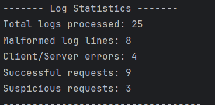
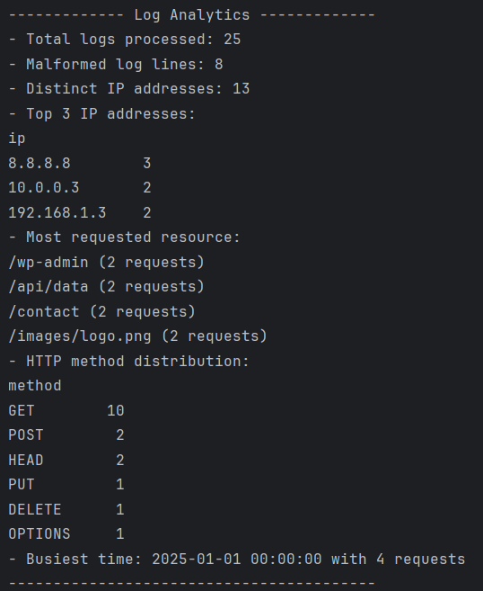
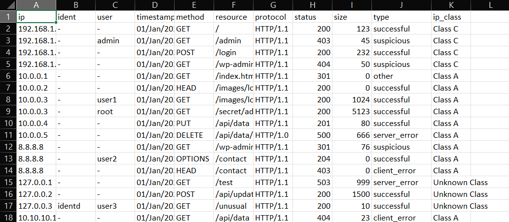

# Web Server Log Parser and Analyzer

A Python-based tool to **parse**, **classify**, and **analyze** web server log files using regular expressions and pandas. It provides CSV export, error classification, IP categorization, and analytics.

---

## Features

- Parses standard web server logs in the Common Log Format
- Classifies:
  - HTTP request status (`successful`, `client_error`, `server_error`, `suspicious`, etc.)
  - IP address class (`Class A`, `Class B`, etc.)
- Provides:
  - Top IPs
  - Most requested resources
  - HTTP method distribution
  - Busiest request time
- Exports parsed logs to CSV
- Logs malformed entries and total stats

---

## Requirements

- Python
- pandas

## To run the code:

```bash
python WebLogParser.py access.log access.csv
```

## Test classes:
- TestLogParser:
  - Tests valid log parsing and ensures that malformed log entries return None.

- TestClassificationFunctions:
  - Tests the helper functions classify_status and classify_ip with various inputs to ensure proper categorization.

- TestLogProcessor:
  - Creates a temporary log file containing one valid log entry and one malformed entry. 
  - Tests that the parser correctly processes the file and builds a DataFrame, counting total entries and malformed lines as expected.

## Output Screenshot:





